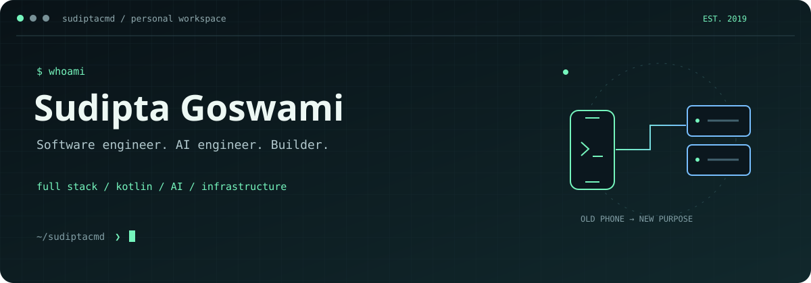
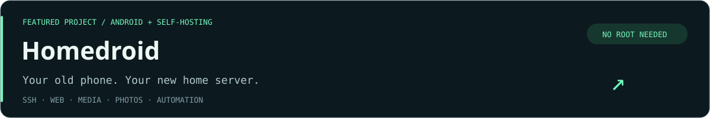
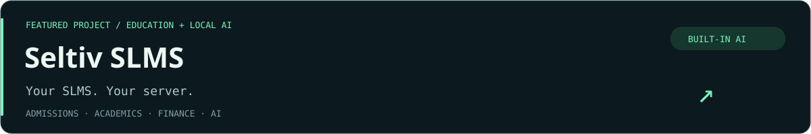
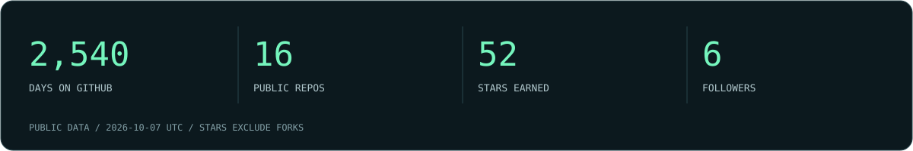

<p align="center">
  
</p>

<p align="center">
  <a href="https://sudipta.seltiv.com">Portfolio</a> &nbsp; · &nbsp;
  <a href="https://www.linkedin.com/in/sudiptagoswamibd/">LinkedIn</a> &nbsp; · &nbsp;
  <a href="mailto:sudiptagoswami63@gmail.com">Email</a> &nbsp; · &nbsp;
  <a href="https://github.com/sudiptacmd?tab=repositories">Repositories</a>
</p>

### `01` / whoami

**Software Engineer · AI Engineer · Full Stack Developer · Kotlin Developer**

I'm **Sudipta Goswami**, based in Dhaka, Bangladesh. I build web applications, Android software, AI systems, and the infrastructure that runs them. I've worked independently since 2018, delivering software for more than 30 clients.

```text
sudiptacmd@github:~$ cat now.txt

  role      Software Engineer II / Technical Lead
  team      Expressive Communications Ltd.
  focus     Full stack systems, agentic AI, Android & self-hosting
  building  Homedroid + Seltiv SLMS
```

### `02` / ls projects/

<a href="https://github.com/sudiptacmd/homedroid"></a>

SSH, web hosting, Jellyfin, Immich, qBittorrent, and Home Assistant on an Android phone, managed from a web dashboard. Built with **Kotlin**.

[Explore Homedroid ↗](https://github.com/sudiptacmd/homedroid) &nbsp; · &nbsp; [Get the APK ↗](https://github.com/sudiptacmd/homedroid/releases/latest)

<a href="https://github.com/sudiptacmd/seltiv-slms"></a>

A self-hosted **Student Lifecycle Management System** for admissions, attendance, academics, finance, and parent communication. Four portals, your own server, and no per-student software fees. Hosting and service costs depend on usage.

**Built-in AI:** describe marking changes in English, বাংলা, or Banglish; review the proposal and approve it. Powered by a local Ollama model, with approval history and validated allocations.

[Explore Seltiv SLMS ↗](https://github.com/sudiptacmd/seltiv-slms#readme) &nbsp; · &nbsp; [Watch AI in action ↗](https://github.com/sudiptacmd/seltiv-slms/blob/main/video/ai-live/seltiv-ai-live.mp4) &nbsp; · &nbsp; [All walkthroughs ↗](https://github.com/sudiptacmd/seltiv-slms#watch-it-work)

### `03` / cat stack.txt

| Area | Tools I work with |
|---|---|
| **Web & full stack** | TypeScript · JavaScript · React · Next.js · Node.js · FastAPI · Django |
| **Android** | Kotlin |
| **AI & ML** | Python · Agentic system design · LangChain · PyTorch · TensorFlow · MLOps |
| **Infrastructure** | Linux · Docker · Kubernetes · Ansible · Nginx · GitHub Actions |
| **Cloud & data** | AWS · GCP · Azure · PostgreSQL · MongoDB · Redis |

### `04` / more about me

- **Client work:** e-commerce, internal tools, interactive 3D websites, and production infrastructure. [Explore the projects on my portfolio →](https://sudipta.seltiv.com/#projects)
- **Education:** B.Sc. in Computer Science & Engineering at BRAC University, 2022–2026. Software Development & AI specialization; Vice Chancellor's Excellence Awardee.
- **Research:** visual question answering for NCTB textbooks.
- **Also built:** [ShelluMama](https://github.com/sudiptacmd/ShelluMama), a Unix shell in C with pipes, redirection, command history, and signal handling.

### `05` / public signals



<details>
<summary>Open the plain-text stats</summary>

<!-- STATS:START -->
Updated 2026-09-30 (UTC). Public data only.

- Days On Github: **2,533**
- Public Repos: **16**
- Stars Earned: **36**
- Followers: **5**

Joined 2019-10-24. Stars count owned public repositories, excluding forks.
<!-- STATS:END -->

</details>

---

<p align="center"><sub>Have something in mind? <a href="mailto:sudiptagoswami63@gmail.com">Let's build it.</a></sub></p>
